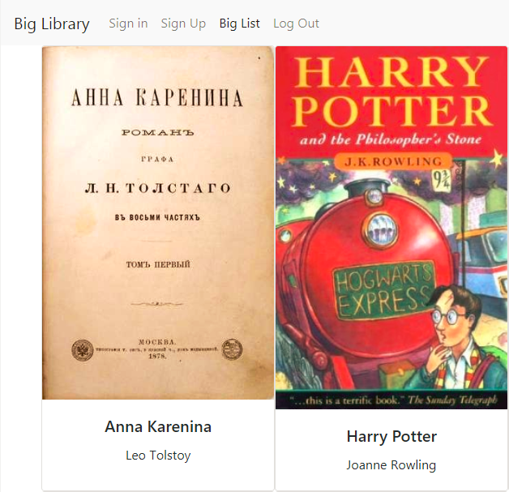

# Big Library web site
## Description
This is a website done in Code Factory Vienna web development school for learning purposes. I did the work based on assignment text on my own. The goal of this project is to practice CRUD operations in PHP with mySQL database. The main project files are in the folder " biglibrary_bootstrap". The folder "biglibrary" contains an incomplete draft based on plain HTML.
## Screenshot

## Technologies used
+ Back-end is done in PHP 7.2.6
+ Front-end is implemented with Bootstrap framework
+ Data are stored in a mySQL database
## Installation
+ Upload all files from the folder “biglibrary_bootstrap” to your Apache server
+ Create an empty mySQL database called “cr10_ivan_zykov_biglibrary”
+ Import file cr10_ivan_zykov_biglibrary.sql from the repo root directory into the database
+ Edit file biglibrary_bootstrap/db_connect.php. Change values of the following variables as required to connect to the database: DBHOST, DBUSER, DBPASS, DBNAME
## Features to be implemented
+ Add functionality that allows a user to modify and delete an existing item in the library
+ Add functionality that allows a user to add new item to the library
+ Implement operations with database using AJAX technology
